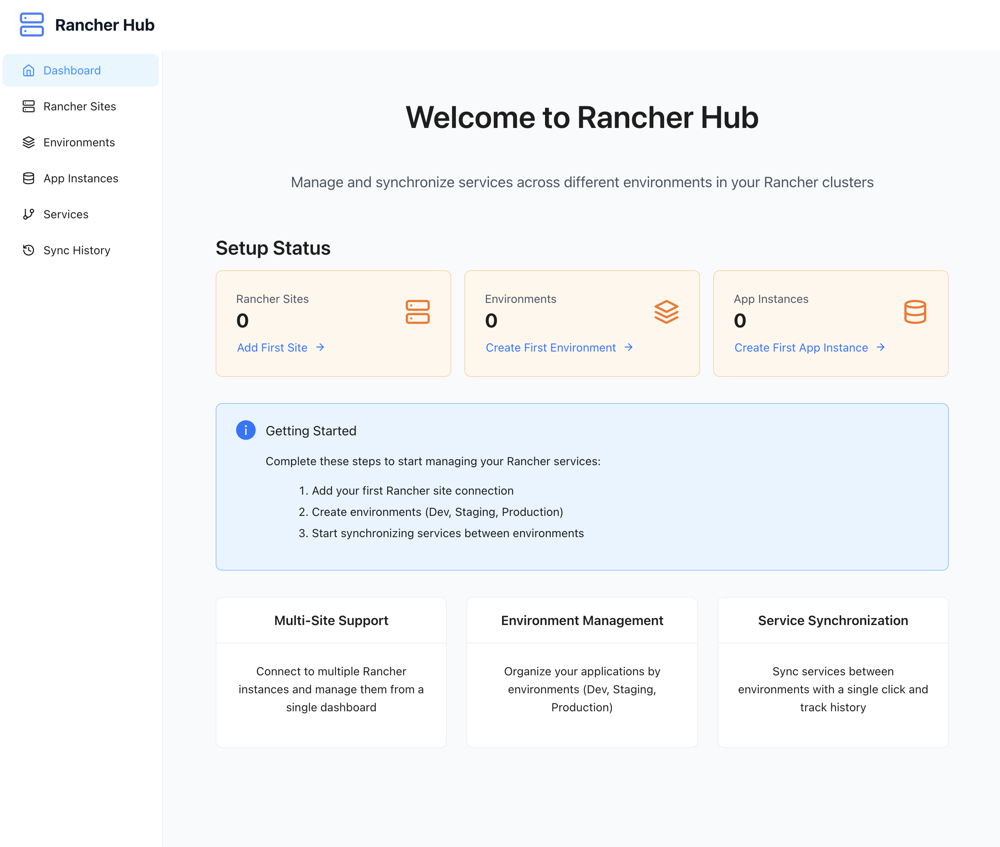

# Rancher Hub - Service Sync Manager

A comprehensive tool for managing and synchronizing services across different environments in Rancher clusters.

## Features

- **Multi-Site Support**: Connect to multiple Rancher instances
- **Environment Management**: Organize your applications by environments (Dev, Staging, Production)
- **Service Synchronization**: Sync services between environments with a single click
- **Visual Dashboard**: Clean UI for managing all your Rancher resources
- **Sync History**: Track and review synchronization operations

## Screenshot



## Quick Start

### Prerequisites

- Node.js >= 18.0.0
- npm >= 8.0.0
- Docker (for development environment)

### Development Setup

#### Option 1: Local Development (Recommended)

1. Install dependencies:
```bash
npm install
```

2. Copy environment files:
```bash
cp backend/.env.example backend/.env
cp frontend/.env.example frontend/.env
```

3. Start development servers:
```bash
npm run dev
```

This will start both the backend (NestJS) and frontend (React + Vite) servers concurrently.

- Frontend: http://localhost:5173
- Backend API: http://localhost:3000
- API Documentation: http://localhost:3000/api/docs

#### Option 2: Docker Development

1. Start with Docker Compose:
```bash
docker-compose up --build
```

This will start all services including PostgreSQL database.

- Frontend: http://localhost:5173  
- Backend API: http://localhost:3000
- PostgreSQL: localhost:5432

### Project Structure

```
rancher-hub/
├── backend/          # NestJS backend application
├── frontend/         # React frontend application
├── docs/            # Documentation
├── docker-compose.yml # Development environment
└── PROJECT_PLAN.md  # Detailed project plan
```

## Architecture

- **Frontend**: React + TypeScript + Vite + Tailwind CSS + Ant Design
- **Backend**: NestJS + TypeScript + TypeORM + SQLite/PostgreSQL
- **State Management**: Zustand + React Query
- **Authentication**: Rancher API tokens

## Development

### Available Scripts

- `npm run dev` - Start both frontend and backend in development mode
- `npm run build` - Build both applications for production
- `npm run test` - Run tests for both applications
- `npm run lint` - Lint both applications

### Environment Variables

Create `.env` files in both `backend/` and `frontend/` directories based on the `.env.example` files.

## License

Private project - All rights reserved.